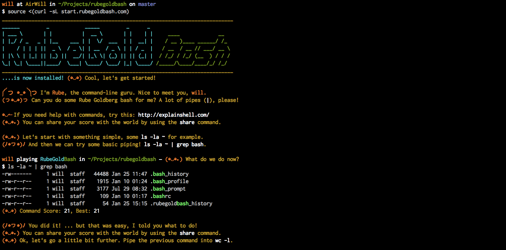

[RubeGoldBash](http://www.rubegoldbash.com) 
==============

~~~
______         _            _____         _      _                           
| ___ \       | |          |  __ \       | |    | |    ____             __   
| |_/ / _   _ | |__    ___ | |  \/  ___  | |  __| |   / __ )____ ______/ /_  
|    / | | | ||  _ \  / _ \| | __  / _ \ | | / _  |  / __  / __ // ___/ __ \ 
| |\ \ | |_| || |_) ||  __/| |_\ \| (_) || || (_| | / /_/ / /_/ (__  ) / / / 
\_| \_| \____||____/  \___| \____/ \___/ |_| \____//_____/\____/____/_/ /_/  
(っ◕‿◕)っ is an awesome game!
~~~

> A command-line quest where your goal is to invent Rube Goldberg machines in bash! Create the longest one-liners you can, the more pipes (|) the better.
> Master Rube ((◕‿◕) Hi there!) will help you during your quest.

- View the [RubeGoldBash website](http://www.rubegoldbash.com)!
- Look at the [RubeGoldBash High Scores](http://highscore.rubegoldbash.com)!
- Look at this [little demo](http://showterm.io/a06f7dcf548aadbbcb751)!

## Getting Started

First open your favorite prompt, and then:

~~~bash
bash
source <(curl -sL start.rubegoldbash.com)

# Use share to submit your score:
rubeshare
# Use exit to stop RubeGoldBash
exit
~~~

The game relies on `bash` and `curl` to work, as well as other bash builtins and standard UNIX tools.

## Look, screnshot!

## Built with

- A lot of Bash
- ASCII Art!
- Some Node, Express, MongoDB

- http://heroku.com/
- http://simplybuilt.com/
- https://github.com/thibweb/dotfiles

### Online services

- http://commandlinefu.com/
- http://www.yodaquotes.net/
- http://ip.appspot.com/
- http://whenwillitbedone.trgdy.com/
- http://translate.google.com/
- http://ifconfig.me/
- http://openweathermap.org/
- http://freegeoip.net/

### Command line

- http://patorjk.com/software/taag/#p=display&h=2&v=1&f=Slant&t=RubeGoldBash
- https://github.com/olizilla/asciify
- https://github.com/maxogden/cool-ascii-faces

## Related

### Main concept

- https://en.wikipedia.org/wiki/Rube_Goldberg_machine
- https://en.wikipedia.org/wiki/Unix_philosophy
- https://en.wikipedia.org/wiki/Turboencabulator
- http://blog.codinghorror.com/rube-goldberg-software-devices/

### Games

- https://github.com/mprat/Terminus
- https://xss-game.appspot.com/
- https://github.com/Gazler/githug
- https://alexnisnevich.github.io/untrusted/
- http://www.mobygames.com/game/dos/incredible-machine

### Videos

- https://www.youtube.com/watch?v=_ve4M4UsJQo
- https://www.youtube.com/watch?v=H6wXKVpWWHY

## Contributing

- [High Score server repository](https://github.com/ThibWeb/rubegoldbash-server)

## Examples of RubeGoldBash (SPOILERS!)

~~~bash
# Retrieve the weather for your location
curl -s ip.appspot.com | xargs -n 1 curl -s "freegeoip.net/csv/$1" | cut -d ',' -f '9 10' | sed 's/,/\&lon=/g' | xargs -n 1 echo "http://api.openweathermap.org/data/2.5/weather?mode=html&lat=$1" | sed 's/ //g' | xargs -n 1 curl -s $1 | tee weather.html
# Same request, with display to the prompt using lynx
curl -s ip.appspot.com | xargs -n 1 curl -s "freegeoip.net/csv/$1" | cut -d ',' -f '9 10' | sed 's/,/\&lon=/g' | xargs -n 1 echo "http://api.openweathermap.org/data/2.5/weather?mode=html&lat=$1" | sed 's/ //g' | xargs -n 1 curl -s $1 | lynx -stdin -dump

# Retrieve the answer to "When will it be done?" (scraping) and make a nice voice read it for you.
lynx --dump whenwillitbedone.trgdy.com | head -n 8 | tail -n 4 | tr "\\n" ' ' | cut -d '[' -f 1 | sed 's/   //g' | sed "s/'/ /g" | perl -pe 's/([^a-zA-Z0-9_.!~*()'\''-])/sprintf("%%%02X", ord($1))/ge' | xargs -n 1 echo "http://translate.google.com/translate_tts?ie=UTF-8&tl=en&q=$1" | sed 's/ //g' | xargs -n 1 curl -s "$1" > whenwillitbedone.mp3
# File can be read with
afplay whenwillitbedone.mp3

# Count the number of folders in the current working directory.
ls -l | cut -c 1 | grep d | wc -l

# Find the longest name
cat /usr/share/dict/propernames | grep 'S' | awk '{print length($1), $1}' | sort -n | tail -n 1 | cut -d ' ' -f 2
# And spell it
cat /usr/share/dict/propernames | grep 'S' | awk '{print length($1), $1}' | sort -n | tail -n 1 | cut -d ' ' -f 2 | say
~~~

## Related commands to play with

~~~bash
# DNS IP lookup
dig +short myip.opendns.com @resolver1.opendns.com

# WS IP lookup
curl ip.appspot.com
curl ifconfig.me/ip
curl ipinfo.io/ip

# WS location lookup
curl freegeoip.net/csv/116.193.147.34
curl ipinfo.io/geo

# Current weather (it wouldn't be Rube Goldberg-y if it was useful)
curl "http://api.openweathermap.org/data/2.5/weather?lat=-41.00&lon=174.00&mode=html"

# Sound
curl "http://translate.google.com/translate_tts?ie=UTF-8&tl=en&q=hello+world" > test.mp3
afplay test.mp3

# Dict
curl dict://dict.org/d:test

# Scraping
curl whenwillitbedone.trgdy.com | grep '
'

## Cal
cal | sed "s/.*/ & /;s/ $(date +%d) / [] /"
cal | sed "s/.*/ & /;s/ $(date +%d) / $(printf '\e[0;31m[]\e[0m') /"

## Cool one-liners
perl -le '$l=80;$l2="!" x $l;substr+($l2^=$l2),$l/2,1,"\xFF";{local $_=$l2;y/\0\xFF/ ^/;print;($lf,$rt)=map{substr $l2 x 2,$_%$l,$l;}1,-1;$l2=$lf^$rt;select undef,undef,undef,.1;redo}'
echo -e "\e[32m"; while :; do for i in {1..16}; do r="$(($RANDOM % 2))"; if [[ $(($RANDOM % 5)) == 1 ]]; then if [[ $(($RANDOM % 4)) == 1 ]]; then v+="\e[1m $r   "; else v+="\e[2m $r   "; fi; else v+="     "; fi; done; echo -e "$v"; v=""; done
yes "$(seq 232 255;seq 254 -1 233)" | while read i; do printf "\x1b[48;5;${i}m\n"; sleep .01; done

## Building blocks to use
last
cat /dev/urandom | hexdump -C | grep "ca fe"
cat /usr/share/dict/propernames
cat /usr/share/dict/connectives
whatis
~~~
